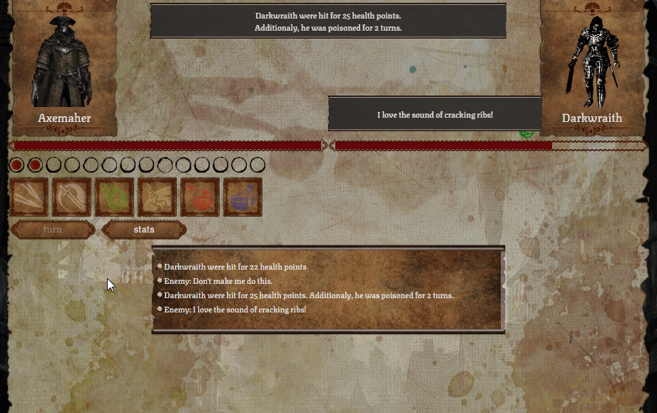

# Turn based combat simulator
Duel simulation based on thoughtful management of action points.
The project is constantly being developed

[live](https://tbcs.netlify.app/)

## Screenshot

## Technologies
* HTML
* CSS
* JS
* React

## Features
* Combat depends on action points.
* You can view the statistics in real time.
* The log informs us about the current course of the fight.
* We have several types of skills to use, e.g. attack, special attack or utilities.
* Skills may have additional effects, e.g. bleeding or healing the caster for a certain number of turns.
* On a smartphone, the skill information is previewed by holding down the tile.
* Defense system

## Built with
* unit tests (jest)
* redux
* game-icons.net

## Setup
After you clone this repo to your desktop, go to its root directory and run npm install to install its dependencies.

Once the dependencies are installed, you can run npm start to start the application. You will then be able to access it at localhost:3000

## License
[MIT](https://choosealicense.com/licenses/mit/)
